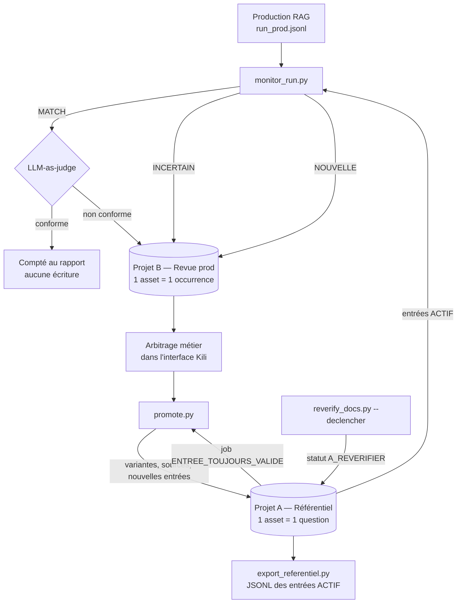

# Référentiel RAG — monitoring métier d'un RAG d'assurance

Deux projets Kili **TEXT**, pilotés par le SDK Python **épinglé à
`kili==2.142.1`**, pour tenir un référentiel de questions-réponses validées
par le métier et arbitrer, run après run, ce que produit la RAG.

La production pose des questions. Chaque question est appariée au
référentiel. Si elle y figure, la réponse générée est confrontée
automatiquement aux réponses validées ; sinon, ou si le verdict est
douteux, le cas part en revue métier et enrichit le référentiel. Une même
question porte plusieurs formulations valides, ce qui permet au
LLM-as-judge de juger plus finement.

---

## À vérifier au premier run

Rien de ce qui suit n'a pu être validé sans instance Kili : la liste est à
parcourir dans l'ordre, la première fois.

1. **Rendu rich text côté serveur.** Le format `json_content` n'est validé
   par aucune couche du SDK : il est sérialisé et téléversé tel quel. Le
   rendu dépend de la version **serveur** de l'instance, pas du SDK.
   Lancer `scripts/probe_richtext.py` **avant tout le reste** et regarder,
   sur l'asset unique qu'il importe : niveaux de titre `h1`–`h4`, marques
   (gras, italique, code, souligné), fonds de couleur, alignements,
   listes, citation, tableau. Ce qui ne s'affiche pas doit être retiré de
   `rendering.py`.
2. **Taille maximale d'un `json_metadata`.** Non documentée par Kili. Le
   projet suppose un seuil prudent de `60 000` octets
   (`TAILLE_MAX_METADATA`) et bascule au-delà sur une metadata allégée
   (voir « Repli de taille » plus bas). Mesurer la vraie limite en
   important une entrée volumineuse, puis ajuster le paramètre.
3. **`update_properties_in_assets(json_contents=…)`.** À l'import,
   `append_many_to_dataset` téléverse le `json_content` dans un bucket et
   enregistre une URL. À la mise à jour, en revanche, le SDK envoie la
   **chaîne JSON telle quelle** au GraphQL (`json_contents: List[str]`).
   Vérifier que le serveur l'accepte et que la carte se rafraîchit bien
   après un `promote.py`. Si ce n'est pas le cas, il faudra supprimer puis
   réimporter l'asset.
4. **`send_back_to_queue` sur un asset déjà labellisé.** Utilisé par
   `reverify_docs.py --declencher`. Vérifier que l'asset revient bien dans
   la file `TODO` de l'annotateur **sans perdre ses labels**.
5. **Disponibilité du modèle d'embeddings.** La valeur par défaut est
   `jina-embeddings-v5-nano`. `JinaEmbeddings.verifier_modele()` interroge
   `GET {URL_JINA}/models` et échoue avec un message clair si le modèle
   n'y figure pas. Le point d'entrée `/models` et l'identifiant du modèle
   n'ont pas été vérifiés contre le service réel.
6. **Signatures 2.142.1 utilisées.** Toutes ont été relues dans la roue
   installée, aucune n'a été exécutée contre une instance :
   `create_project(title, input_type, json_interface, description)`,
   `append_many_to_dataset(project_id, external_id_array,
   json_content_array, json_metadata_array)`,
   `update_properties_in_assets(project_id, external_ids, json_metadatas,
   json_contents, priorities)`, `assets(project_id, fields, metadata_where)`,
   `append_labels(project_id, asset_external_id_array, json_response_array,
   label_type)`, `send_back_to_queue`, `delete_many_from_dataset`,
   `archive_project`, `delete_project`.
7. **Filtre `metadata_where`.** La lecture des cas de revue s'appuie sur
   `metadata_where={"statut_revue": "EN_ATTENTE"}`. Le filtre est
   re-appliqué en Python après lecture ; vérifier tout de même qu'il ne
   renvoie pas une liste vide côté serveur.
8. **Piste d'audit en label `INFERENCE`.** Les variantes versées au
   référentiel sont aussi écrites comme labels `REPONSE_VALIDEE` de type
   `INFERENCE`, pour ne pas être relues comme des arbitrages humains.
   Vérifier que ces labels sont visibles dans l'interface ; sinon, s'en
   tenir à `kili.labels()` pour les consulter.
9. **URL des projets.** `demo.py` construit l'URL en retirant `/api/…` de
   l'endpoint GraphQL, puis en ajoutant `/label/projects/<id>`. À corriger
   si le chemin diffère sur l'instance.
10. **`InputType` en 2.142.1.** La liste réelle du SDK installé est
    `AUDIO, IMAGE, PDF, TEXT, TIME_SERIES, VIDEO, VIDEO_LEGACY` —
    `VIDEO_LEGACY` en plus de ce qui était annoncé. Aucun type LLM,
    aucun module `kili.llm`, aucune clé `level` : confirmé par lecture du
    paquet installé.
11. **Catégories des `json_interface`.** Les catégories sont écrites
    `{"CODE": {"name": "Libellé", "children": []}}`, sans clé `id`. Le SDK
    ne valide pas le `json_interface` : il le sérialise et l'envoie.
    Vérifier que les deux projets s'ouvrent et que les jobs s'affichent
    comme attendu ; ajouter un `id` par catégorie si l'interface les
    exige.
12. **Modèle du juge.** `claude-sonnet-5` par défaut, via le SDK
    `anthropic`. Le prompt attend un objet JSON ; une réponse illisible
    est traitée comme « non conforme, confiance nulle », ce qui envoie le
    cas en revue plutôt que de le passer sous silence.

---

## Workflow



**Le verdict du juge n'est jamais affiché à l'annotateur.** Il reste en
metadata et sert à sélectionner les cas et à mesurer le désaccord
juge / métier. L'afficher ancrerait l'annotateur sur l'avis qu'on cherche
justement à auditer.

### Topologie

| | Projet A — « Référentiel RAG » | Projet B — « Revue prod RAG » |
| --- | --- | --- |
| Un asset | une question | une occurrence de production |
| Rôle | état de vérité | file de travail du métier |
| `external_id` | `q_<sha1(question normalisée)[:12]>` | `<question_id>__<run_id>` |
| Écrit par | `bootstrap.py`, `promote.py`, `reverify_docs.py` | `monitor_run.py`, `promote.py` |
| Annoté | à la création et lors des campagnes de revérification | en continu |

La normalisation (minuscules, sans accents, sans ponctuation, espaces
réduits) est une fonction pure et testée : `normalisation.py`.

---

## Modèle de données

Les schémas pydantic de `schemas.py` sont sérialisés dans le
`json_metadata` des assets.

### Entrée du référentiel (projet A)

```json
{
  "question_id": "q_a1b2c3d4e5f6",
  "question": "Quel est le délai de déclaration d'un sinistre auto ?",
  "statut": "ACTIF",
  "version": 3,
  "answers": [
    {"id": "a1", "text": "…", "origine": "metier",
     "auteur": "c.durand", "date": "2026-03-11", "run_id": null},
    {"id": "a2", "text": "…", "origine": "rag_valide",
     "auteur": "m.leroy", "date": "2026-05-02", "run_id": "run_42"},
    {"id": "a3", "text": "…", "origine": "rag_corrige",
     "auteur": "m.leroy", "date": "2026-07-18", "run_id": "run_57"}
  ],
  "sources": [
    {"doc_id": "cg_auto_2024.pdf", "page": 12, "doc_version": "sha1:9f3c…"}
  ],
  "derniere_verification": "2026-07-18",
  "repli_texte": false
}
```

- `statut` ∈ `ACTIF`, `A_REVERIFIER`, `ARCHIVE`. **Seul `ACTIF` entre dans
  le scoring** ; `monitor_run.py` ne charge que ces entrées.
- `origine` ∈ `metier`, `rag_valide`, `rag_corrige`.
- `auteur` est le **métier qui a arbitré dans le projet B**, recopié depuis
  le label ; ce n'est pas la clé d'API qui écrit dans A.
- Il n'existe **aucune notion de contre-exemple** : un verdict `NON` est
  compté au rapport et n'écrit rien.

### Cas de revue (projet B)

```json
{
  "question_id": "q_a1b2c3d4e5f6",
  "run_id": "run_42",
  "motif": "DIVERGENCE",
  "question": "Sous quel délai déclarer un accident de voiture ?",
  "candidate_answer": "Vous disposez de **5 jours ouvrés**…",
  "sources": [{"doc_id": "cg_auto_2024.pdf", "page": 12,
               "doc_version": "sha1:9f3c…"}],
  "verdict_juge": {"conforme": false, "confiance": 0.31,
                   "motif": "délai divergent"},
  "score_appariement": 0.68,
  "question_id_candidat": null,
  "statut_revue": "EN_ATTENTE",
  "repli_texte": false
}
```

- `motif` ∈ `NOUVELLE_QUESTION`, `DIVERGENCE`, `APPARIEMENT_INCERTAIN`,
  `REVERIFICATION_DOC`.
- `statut_revue` ∈ `EN_ATTENTE`, `PROMU`, `REJETE`.
- `question_id_candidat` n'est renseigné que pour un appariement incertain.

### Repli de taille du `json_metadata`

Toute écriture passe par `storage.py`. Si la metadata sérialisée dépasse
`TAILLE_MAX_METADATA`, ou si le serveur refuse l'écriture pour cause de
volume, on bascule sur une metadata allégée :

- les textes longs sont retirés (`candidate_answer`, `answers[].text`) ;
- la question est **conservée** — c'est la clé fonctionnelle de l'entrée,
  et sa taille est bornée ;
- l'entrée est marquée `repli_texte: true` ;
- **les textes restent lisibles dans le `json_content`**, c'est-à-dire dans
  la carte affichée à l'annotateur.

Conséquence assumée : `promote.py` refuse d'ajouter une variante à une
entrée repliée, plutôt que de dédoublonner sur des textes absents. Le cas
est journalisé en `ERROR`.

---

## `json_interface` du projet A — Référentiel

| Job | Type | Requis | Rôle |
| --- | --- | --- | --- |
| `ENTREE_TOUJOURS_VALIDE` | radio `OUI` / `NON` | oui | campagne de revérification |
| `REPONSE_VALIDEE` | transcription | non | ajouter ou corriger une formulation |
| `SOURCES_CORRIGEES` | transcription | non | liste au format `doc.pdf:12, autre.pdf:3` |

- `OUI` sur `ENTREE_TOUJOURS_VALIDE` repasse l'entrée en `ACTIF` et
  actualise `derniere_verification` ; `NON` la passe en `ARCHIVE`.
- Les trois jobs sont `CLASSIFICATION` ou `TRANSCRIPTION`, sans clé
  `level` : elle n'existe pas en 2.142.1.

## `json_interface` du projet B — Revue prod

| Job | Type | Requis | Rôle |
| --- | --- | --- | --- |
| `MEME_QUESTION` | radio `OUI` / `NON` | non | uniquement si `motif = APPARIEMENT_INCERTAIN` ; l'instruction le dit |
| `CANDIDATE_CORRECTE` | radio `OUI` / `PRESQUE` / `NON` | oui | verdict métier sur la réponse générée |
| `VERSION_CORRIGEE` | transcription | non | la bonne formulation quand `PRESQUE` |
| `SOURCES_PERTINENTES` | radio `OUI` / `PARTIEL` / `NON` | oui | les sources citées soutiennent-elles la réponse ? |
| `SOURCES_CORRIGEES` | transcription | non | liste corrigée, même format |

Ce que `promote.py` en fait :

| Arbitrage | Effet sur le référentiel |
| --- | --- |
| `CANDIDATE_CORRECTE = OUI` | la réponse candidate rejoint `answers[]`, `origine = rag_valide` |
| `PRESQUE` **et** `VERSION_CORRIGEE` renseignée | c'est le texte corrigé qui rejoint `answers[]`, `origine = rag_corrige` |
| `PRESQUE` sans `VERSION_CORRIGEE` | rien n'est écrit, le cas passe en `REJETE` |
| `NON` | rien n'est écrit, seulement compté au rapport |
| `MEME_QUESTION = NON` sur un cas incertain | **nouvelle** entrée créée dans A |
| `MEME_QUESTION` non rempli sur un cas incertain | le cas reste `EN_ATTENTE`, rien n'est décidé à sa place |
| `SOURCES_CORRIGEES` renseignée | remplace `sources[]` (les `doc_version` connues sont reportées) |
| `SOURCES_PERTINENTES = OUI`, sans correction | les sources de l'occurrence complètent `sources[]` |

---

## Appariement d'une question

`matching.py` expose le protocole `QuestionMatcher` et deux
implémentations.

- **`HybridMatcher`** (par défaut) : BM25 (`rank_bm25`) sur les questions
  normalisées, combiné à une similarité d'embeddings, par somme pondérée
  sur scores normalisés — `0.4` lexical, `0.6` sémantique. Les scores BM25,
  non bornés, sont ramenés dans `[0, 1]` en les divisant par le score que
  chaque entrée obtient **face à elle-même**.
- **`LexicalMatcher`** : BM25 seul, hors ligne, utilisé par la démo et les
  tests.

Deux seuils : au-dessus de `SEUIL_APPARIEMENT_HAUT` (0.72) → `MATCH` ;
entre les deux → `INCERTAIN`, le cas part en revue avec le job
`MEME_QUESTION` ; en dessous de `SEUIL_APPARIEMENT_BAS` (0.45) →
`NOUVELLE`.

Le backend d'embeddings est derrière le protocole `EmbeddingBackend` :
`JinaEmbeddings` (modèle configurable, disponibilité vérifiée au
démarrage) et `FakeEmbeddings` (déterministe, sans réseau, pour les
tests). Le référentiel étant petit, l'index est reconstruit en mémoire à
chaque exécution : **pas de base vectorielle**.

## Accumulation des formulations

- Une variante n'est ajoutée que si elle est **suffisamment distante** des
  formulations déjà présentes : `similarite_lexicale` (indice de Jaccard
  sur les jetons normalisés, la mesure du module d'appariement) doit
  rester sous `SEUIL_QUASI_DOUBLON` (0.85).
- **Plafond de 5 variantes** (`PLAFOND_VARIANTES`). Au-delà, on conserve
  les plus diverses entre elles, et **toujours** la formulation d'origine
  métier.
- Chaque variante retenue est aussi écrite comme label `REPONSE_VALIDEE`
  sur l'asset de A : la metadata porte l'état agrégé, les labels portent
  la piste d'audit horodatée.

## LLM-as-judge

Le protocole `AnswerJudge` reçoit la question, la réponse candidate et la
**liste des formulations validées** (plafonnée à `MAX_REFERENCES_JUGE`).
Le prompt exploite explicitement cette pluralité : *la réponse est-elle
équivalente à au moins une des formulations validées, sans en contredire
aucune ?*

- `JugeClaude` : SDK `anthropic`, modèle `claude-sonnet-5` par défaut.
- `JugeLexical` : recouvrement lexical normalisé au-dessus d'un seuil,
  déterministe et hors ligne, pour la démo et les tests.

Le désaccord juge / métier n'est connu qu'**après** arbitrage : il est
donc compté par `promote.py` (`desaccords_juge_metier`), pas par
`monitor_run.py`.

---

## Sous-ensemble markdown couvert

La RAG produit du markdown. `markdown_to_richtext.py` convertit
markdown → HTML (`markdown-it-py`) → arbre de nœuds Kili.

| Construction markdown | Rendu Kili |
| --- | --- |
| `# … ####` | éléments `h1` à `h4` |
| `##### …`, `###### …` | repliés sur `h4` |
| paragraphe | `p` |
| `**gras**` | **marque** `bold` sur le nœud texte |
| `*italique*` | **marque** `italic` |
| `` `code` `` | **marque** `code` |
| `<u>`, `<ins>` | **marque** `underline` |
| `- …` / `1. …` | `ul` / `ol` + `li` |
| `> …` | `blockquote` (bordure gauche grise) |
| tableau GFM | `table` > `thead`/`tbody` > `tr` > `td` |
| en-tête de tableau (`th`) | `td` en gras sur fond gris — Kili ne connaît pas `th` |

Replis explicites, jamais d'exception :

| Construction | Repli |
| --- | --- |
| bloc de code ` ``` ` | une suite de `p`, chacun marqué `code`, sur fond clair |
| image | nœud texte contenant le texte alternatif, sinon `[image]` |
| lien | texte du lien conservé, URL ajoutée entre parenthèses |
| `<br>` | nœud texte contenant un saut de ligne |
| `<hr>` | paragraphe `———` |
| balise inconnue | son contenu, en texte brut, dans un `p` |
| markdown vide ou illisible | un `p` contenant le texte brut |

Les `id` de nœud texte sont générés par un compteur déterministe
(`GenerateurIds`), **uniques dans tout le document** : deux rendus des
mêmes données produisent exactement le même arbre.

---

## Commandes, dans l'ordre d'un premier usage

```bash
# 0. Installation
uv sync
cp .env.example .env   # puis renseigner KILI_API_KEY

# 1. Vérifier ce que le serveur rend vraiment (5 minutes)
uv run python scripts/probe_richtext.py

# 2. Données factices
uv run python scripts/generate_sample_data.py

# 3. Démonstration complète, sans clé de modèle
uv run python scripts/demo.py --create
```

`demo.py --create` crée les deux projets, importe 12 questions validées,
apparie les 15 occurrences de production avec le matcher **hors ligne**,
et crée les cas de revue. Sortie attendue :

```
=== Démonstration prête ===
Projet A — référentiel : cl…
  https://cloud.kili-technology.com/label/projects/cl…
    12 questions déjà validées.
Projet B — revue prod  : cl…
  https://cloud.kili-technology.com/label/projects/cl…
    10 cas à arbitrer.
```

**Ce qu'il faut regarder dans l'interface Kili :**

- projet A : une carte par question, avec ses formulations validées sur
  fond vert clair, sa provenance (origine, auteur, date) et ses sources en
  tableau ;
- projet B : la question en `h1`, un encadré expliquant le motif de mise
  en revue, les formulations déjà validées en vert, la réponse générée sur
  fond ambre, les sources en tableau ;
- les libellés des jobs, en français, et le fait que `MEME_QUESTION`
  précise qu'il ne concerne que les appariements incertains ;
- **le verdict du juge n'apparaît nulle part** : il est en metadata.

Puis, le cycle courant :

```bash
# Amorcer un référentiel sur des données réelles
uv run python scripts/bootstrap.py --entree data/samples/referentiel_initial.jsonl

# Traiter un run de production (ajouter --hors-ligne pour se passer des clés)
uv run python scripts/monitor_run.py \
    --entree data/samples/run_prod.jsonl \
    --projet-referentiel <ID_A> --projet-revue <ID_B>

# Après arbitrage du métier dans le projet B
uv run python scripts/promote.py \
    --projet-referentiel <ID_A> --projet-revue <ID_B>

# Constater la dérive documentaire (ne modifie rien)
uv run python scripts/reverify_docs.py \
    --projet-referentiel <ID_A> --rapport --versions versions.json

# Déclencher une revérification (aucune invalidation automatique)
uv run python scripts/reverify_docs.py --projet-referentiel <ID_A> \
    --declencher --doc cg_auto_2024.pdf --pages 10-20 --dry-run

# Exporter le référentiel
uv run python scripts/export_referentiel.py --projet-referentiel <ID_A>

# Nettoyer la démonstration
uv run python scripts/demo.py --teardown --project-id <ID>
```

`versions.json` est un simple dictionnaire des versions courantes :

```json
{"cg_auto_2024.pdf": "sha1:9f3c1a2b7d40",
 "cg_habitation_2024.pdf": "sha1:41d8ec5590aa"}
```

### Sorties

| Fichier | Produit par | Contenu |
| --- | --- | --- |
| `reports/monitoring_<horodatage>.json` | `monitor_run.py` | volumes par décision, taux de conformité, latence, cas envoyés en revue |
| `reports/promotion_<horodatage>.json` | `promote.py` | promus, rejetés, variantes ajoutées, **désaccords juge / métier**, sources illisibles |
| `reports/derive_documentaire_<horodatage>.json` | `reverify_docs.py --rapport` | entrées dont une source a changé de version |
| `reports/referentiel_export.jsonl` | `export_referentiel.py` | une ligne par entrée `ACTIF`, avec toutes ses formulations et ses sources |

---

## Revérification documentaire

Les documents bougent souvent de façon mineure : **aucune invalidation
automatique**.

- `--rapport` compare les `doc_version` stockées aux versions courantes et
  **liste** les entrées concernées, sans rien modifier.
- `--declencher --doc … [--pages 10-20]` passe les entrées citant ces
  documents en `statut = A_REVERIFIER`, monte leur priorité et les remet
  dans la file (`send_back_to_queue`). Elles sortent du scoring
  automatique, mais ne sont **jamais supprimées**. Une source sans page
  reste retenue : l'intervalle de pages ne peut pas l'écarter.
- `--dry-run` affiche ce qui serait fait.
- Le retour à `ACTIF`, ou le passage à `ARCHIVE`, se fait par le job
  `ENTREE_TOUJOURS_VALIDE` du projet A, récupéré par `promote.py`.

## Cas limites traités

| Cas | Traitement |
| --- | --- |
| question vide ou tronquée | `calculer_question_id` lève ; l'occurrence est journalisée et comptée dans `ignorees` |
| markdown malformé | conversion tolérante, repli sur un `p` de texte brut |
| source sans page | `page = null` ; rendue « — » dans le tableau, retenue par la revérification |
| référentiel vide au premier run | toute question est `NOUVELLE`, score `0.0` |
| réponse candidate identique à une formulation existante | écartée comme quasi-doublon, `version` inchangée |
| deux occurrences du même run appariées à la même question | `calculer_identifiants` suffixe le second `external_id` (`…__run_42_2`) |
| metadata trop volumineuse | repli documenté, textes conservés dans le rendu |

## Idempotence

`promote.py` peut être relancé sans risque : un cas traité n'est plus
`EN_ATTENTE`, une variante déjà présente est écartée comme quasi-doublon,
`version` n'est incrémentée que si l'état change, et la piste d'audit est
écrite en label `INFERENCE` pour ne pas être relue comme un arbitrage
humain.

---

## Développement

```bash
uv run pytest          # 89 tests, entièrement hors ligne
uv run ruff check .
```

Les tests s'appuient sur un **faux client Kili en mémoire**
(`tests/conftest.py`) : aucun appel réseau, y compris pour les
embeddings (`FakeEmbeddings`) et le juge (`JugeLexical`).

### Arborescence

```
src/rag_referentiel/
  config.py               pydantic-settings : seuils, plafonds, modèles
  client.py               instanciation Kili
  schemas.py              modèles pydantic de metadata
  interfaces.py           les deux json_interface
  normalisation.py        question normalisée, question_id, jetons
  richtext.py             briques du format rich text Kili
  rendering.py            composition des cartes
  markdown_to_richtext.py conversion du markdown de la RAG
  matching.py             QuestionMatcher, HybridMatcher, LexicalMatcher
  embeddings.py           EmbeddingBackend, Jina, FakeEmbeddings
  judge.py                AnswerJudge, Claude et hors ligne
  labels.py               lecture des labels et metadata Kili
  storage.py              écriture avec repli de taille
  referentiel.py          projet A : lecture, écriture, promotion
  revue.py                projet B : création et lecture des cas
scripts/                  bootstrap, monitor_run, promote, reverify_docs,
                          demo, probe_richtext, export_referentiel,
                          generate_sample_data
data/samples/             jeux factices (aucune donnée réelle)
tests/                    pytest, hors ligne
```
